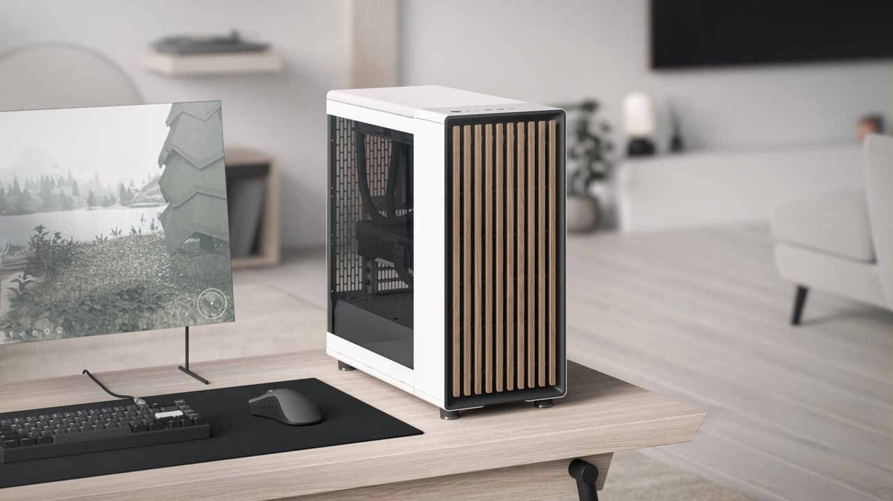

<!-- This is free and unencumbered software released into the public domain -->



<p align=center>
	<a href="https://github.com/ngarside/client/pkgs/container/pro">
		
	</a>
	&nbsp;
	<a href="https://github.com/ngarside/client/pkgs/container/zen">
		
	</a>
</p>

The GitOps codebase for my home computers.

This repo builds two container images (linked above) based on Fedora immutable spins.

# <p align=center>Map

- `common` - Shared configuration
- `mobile` - Laptop configuration
- `pro` - Desktop specific configuration
- `zen` - Zenbook specific configuration

# <p align=center>Installation

To switch to the custom image run:

```sh
# Desktop
sudo bootc switch ghcr.io/ngarside/pro:latest

# Zenbook
sudo bootc switch ghcr.io/ngarside/zen:latest

reboot
```

> Note that on the desktop the integrated graphics must be disabled in the BIOS for the Nvidia
> drivers to function properly.

# <p align=center>Notes

To upgrade to the latest image run:

```sh
sudo bootc upgrade
```

To uninstall all flatpaks run:

```sh
# Leave user data
flatpak remove --all --noninteractive

# Purge user data
flatpak remove --all --noninteractive --delete-data
```

# <p align=center>License

This is free and unencumbered software released into the public domain.

The [header image](media/north.jpg) is copyright [Fractal Design](https://www.fractal-design.com).
